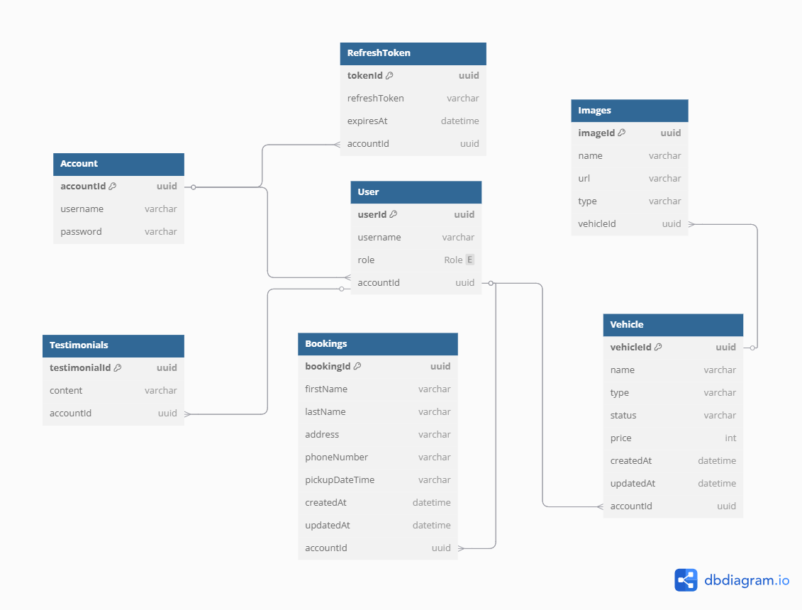

<!-- PROJECT LOGO -->

 

  <h2 align="center">Car_rental_api</h2>

<!-- TABLE OF CONTENTS -->

  
Table of Contents

  <ol>
    <li>
      <a href="#about-the-project">About The Project</a>
      <ul>
        <li><a href="#built-with">Built With</a></li>
        <li><a href="https://github.com/bartue-dev/blog_api/blob/main/api-documentation.md">API Documentation</a></li>
      </ul>
    </li>
    <li><a href="#roadmap">Roadmap</a></li>
  </ol>

<!-- ABOUT THE PROJECT -->

## About The Project

-   car_rental_api is a personal project.
-   To practice creating an API with admin and user role.
-   Usage of supabase storage. Simple cron jobs.
-   Request valication.
-   Proper folder structure
-   This API will be use for the REACTJS front end/client.

(<a href="#readme-top">back to top</a>)

<!-- DB DIAGRAM -->

## DB Diagram

(<a href="#readme-top">back to top</a>)

### Built With

<!-- BADGES -->

-   [![Express.js][Express.js-badge]][Express.js-url]
-   [![Prisma][Prisma-badge]][Prisma-url]
-   [![PostgreSQL][PostgreSQL-badge]][PostgreSQL-url]
-   [![JWT][JWT-badge]][JWT-url]
-   [![express-validator][express-validator-badge]][express-validator-url]

<!-- BADGES -->

[Express.js-badge]: https://img.shields.io/badge/Express.js-000000?style=for-the-badge&logo=express&logoColor=white
[Express.js-url]: https://expressjs.com/
[Prisma-badge]: https://img.shields.io/badge/Prisma-2D3748?style=for-the-badge&logo=prisma&logoColor=white
[Prisma-url]: https://www.prisma.io/
[PostgreSQL-badge]: https://img.shields.io/badge/PostgreSQL-336791?style=for-the-badge&logo=postgresql&logoColor=white
[PostgreSQL-url]: https://www.postgresql.org/
[JWT-badge]: https://img.shields.io/badge/JWT-FFB600?style=for-the-badge&logo=jsonwebtokens&logoColor=black
[JWT-url]: https://jwt.io/
[express-validator-badge]: https://img.shields.io/badge/express--validator-6A1B9A?style=for-the-badge
[express-validator-url]: https://express-validator.github.io/docs/

(<a href="#readme-top">back to top</a>)

<!-- ROADMAP -->

## Roadmap

-   [x] create prisma schema or database design
-   [x] register
-   [x] sign-in
    -   [x] access token in reponse
    -   [x] refresh token save in cookies and database
-   [x] create a middleware that verify jsonwebtoken
-   [x] add cron jobs. every 48 hours the expired refresh token will be deleted
-   [x] create a middleware check the user role first before execute API
-   [x] create a custom error handling.
    -   [x] custom error handling for development
    -   [x] custom error handling for production
    -   [x] custom error handling for prisma
-   [x] set up server with allowed credentials, cors, cookie parser, error handler for unknown api end point and server error handler uncaughtException and unhandledRejection.
-   [x] create api controller
    -   [x] bookings controller
    -   [x] user can add, read, update, delete bookings on its own bookings
    -   [x] admin can read, update, delete all bookings
    -   [x] vehicle controller
    -   [x] admin can add, read, update and delete vehicle
    -   [x] images controller
    -   [x] associated with the vehicle controller
    -   [x] admin add an images for the vehicle
    -   [x] images saves in supabase storage and only the images url save in db
    -   [x] admin add, read, delete images and delete specific image
    -   [x] testimonial controller
    -   [x] user can create testimonial about the service of the business
    -   [x] admin can read, update and delete testimonials
-   [x] create db queries for api controllers
-   [x] create validation for api and auth controller
-   [x] import controller to route file
-   [x] import routes to the server

(<a href="#readme-top">back to top</a>)

